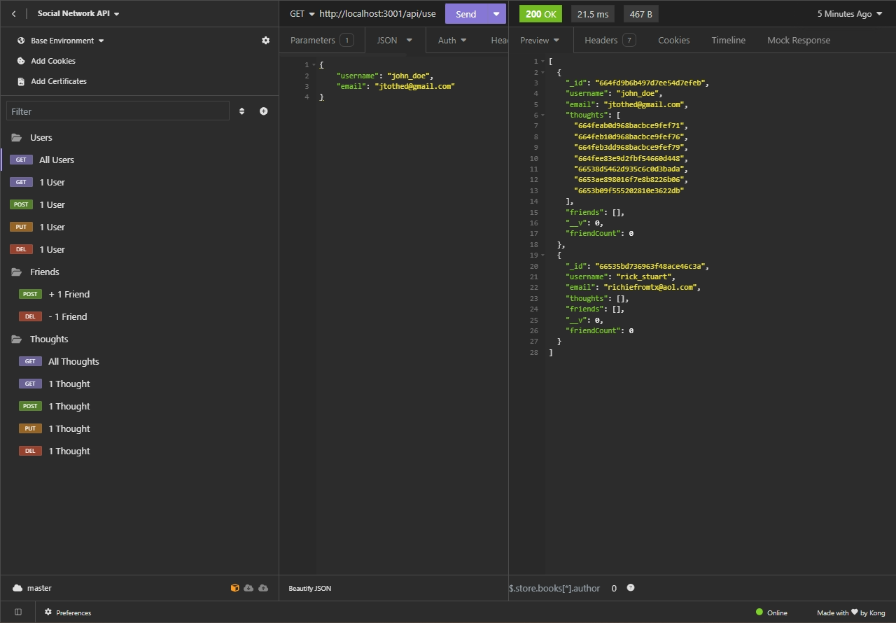

# Social-Networking


## Description
This is the back end of an API for a social network web application that uses Node.js, Express.js, Javascript, MongoDB, and Mongoose ODM to allow users to be created, searched, updated, and/or deleted. Users also have the ability to share their thoughts, react to friends' thoughts, and create a friend list, as well as delete thoughts, reactions, and friends.

## Table of Contents
* [Description](#description)
* [Installation](#installation)
* [Usage](#usage)
* [License](#license)
* [Credits](#credits)

## Installation
Node.js and MongoDB Compass is required to view the database. Clone the repo. Using VS code or your preferred code editor, enter the following in your terminal:

Initialize pkg.json:
```terminal
npm init -y
```
Install dependencies:
```terminal
npm install
```
Start server:
```terminal
nodemon server.js
```
Use Insomnia to reveal data from GET, POST, PUT and DELETE operations for each API route.

## Usage
The app uses create, read, update, and delete operations for each of the following routes: Thoughts and Users, including add/remove friend of User.


[Usage Demonstration](<./assets/social-networking-vid.mp4>)

## License
[License: MIT](https://opensource.org/licenses/MIT)

## Credits

https://www.npmjs.com/package/dotenv

https://www.npmjs.com/package/mongoose

https://www.npmjs.com/package/express

https://www.mongodb.com/docs/v2.2/reference/operator/update/pull/


## Contact
Github Repo - https://github.com/ceci-00/Social-Networking.git

Email - ceci.ga003@gmail.com